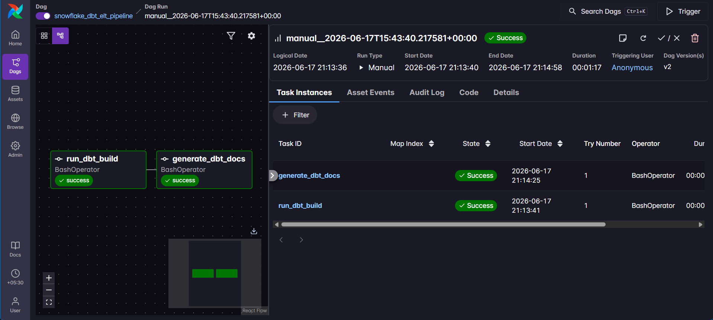
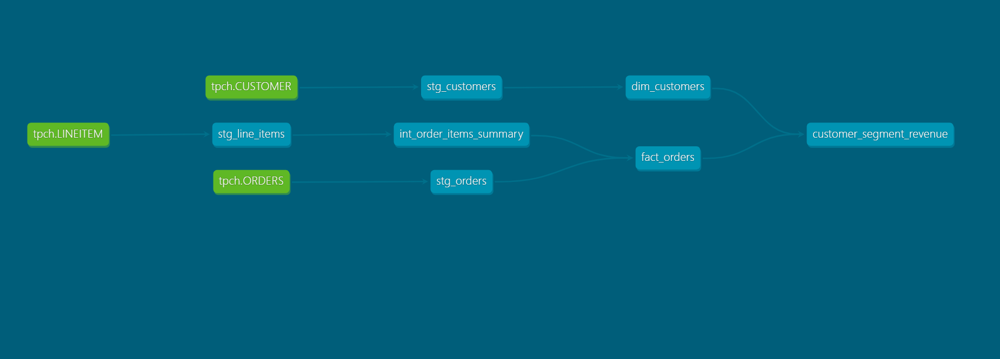

# Snowflake DBT Airflow ELT Pipeline

An end-to-end ELT pipeline built with Snowflake, dbt, and Apache Airflow to transform raw TPCH data into analytics-ready models.

---

## Overview

This project demonstrates a modern analytics engineering workflow using:

- Snowflake as the cloud data warehouse
- dbt for data transformation and modeling
- Apache Airflow for orchestration
- SQL for transformations
- Python for workflow automation

The pipeline transforms raw TPCH data through staging, intermediate, and mart layers before producing business-ready analytics datasets.

---

## Airflow Orchestration



---

## Data Lineage



---

## Technology Stack

| Tool | Purpose |
|--------|---------|
| Snowflake | Cloud Data Warehouse |
| dbt | Data Transformation |
| Apache Airflow | Workflow Orchestration |
| Astro CLI | Local Airflow Development |
| SQL | Data Modeling |
| Python | Automation |

---

## Project Structure

```text
Snowflake-DBT-Airflow-ELT-Pipeline
│
├── airflow/
│   ├── dags/
│   ├── include/
│   └── requirements.txt
│
├── dbt/
│   └── tpch_analytics/
│       ├── models/
│       ├── macros/
│       ├── seeds/
│       └── tests/
│
├── orchestration/
│
├── images/
│   ├── airflow.png
│   └── dbt-dag.png
│
├── README.md
└── .gitignore
```

---

## Data Model Layers

### Staging Layer

- stg_customers
- stg_orders
- stg_line_items

### Intermediate Layer

- int_order_items_summary

### Mart Layer

- dim_customers
- fact_orders
- customer_segment_revenue

---

## Airflow Workflow

The Airflow DAG automates the dbt workflow using two tasks:

```text
run_dbt_build
        │
        ▼
generate_dbt_docs
```

### Tasks

| Task | Description |
|--------|-------------|
| run_dbt_build | Executes dbt build |
| generate_dbt_docs | Generates dbt documentation |

---

## Analytics Output

The pipeline produces analytics-ready datasets including:

- Customer Dimension
- Order Fact Table
- Revenue Metrics
- Customer Revenue Segmentation

---

## Key Features

- End-to-end ELT architecture
- Snowflake cloud warehouse integration
- dbt modular transformations
- Airflow orchestration
- Automated documentation generation
- Data lineage tracking
- Analytics-ready data marts

---

## Results

Successfully implemented:

- Snowflake data warehouse integration
- dbt transformation framework
- Airflow orchestration pipeline
- Automated documentation workflow
- Star-schema style analytics models
- End-to-end data lineage tracking

---

## Author

**Akila Kavinda**